**BIG-IP DNS: Global Server Load Balancing**

> Written for: TMOS® v12.0

{width="0.8715277777777778in"
height="0.7638888888888888in"}

> Last Updated: 3/17/2016

DNS
Lab – Getting Started

Your F5 has already been configured with the following:

-   Networking: VLANs, SelfIPs, Routing

-   DNS, NTP

Students will connect to the Win7 Jumpbox as shown below via a URL Link
from the Landing Page.

Your F5 devices are accessible via HTTPS and SSH from the Win7 Jumpbox
at:

GTM1 10.128.1.245 //Configuration for Lab Exercises 1.1 thru 2.3

GTM2 10.128.1.246 //Configuration for Lab Exercise 3.1

LTM-East 10.128.1.247 //Used for Lab Exercises 1.1 thru 3.1

Lamp-West 10.0.0.10 //Used for Lab Exercises 1.1 thru 3.1

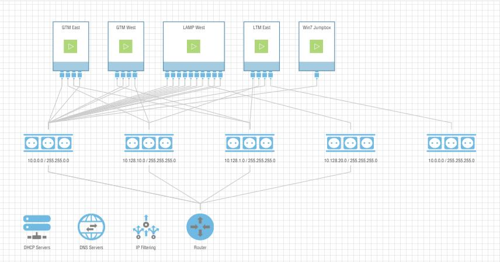{width="7.05in" height="3.6929877515310587in"}

To access your Ravello Lab Environment, from either Chrome or Mozilla
Browser connect to the Ravello Training Portal **(Ask an instructor for
the IP address)**

Type in your username such as ***dns101\_student1***,
***dns101\_student2***, etc.. with a shared password of "**DnS101**"

Select ‘View’ Under the Actions Column associated with the DNS101 lab.

 

Once you are logged in, you will see the URL for your specific windows
jump box needed to proceed with the lab.  A student view:

 

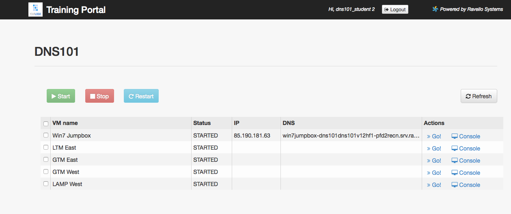{width="7.05in" height="2.9606419510061244in"}

NOTE: All of the VMs should be in a STARTED state, if a VM is in any
other state please let the Lab Instructors know or you can attempt to
RESTART the VM yourself.

Select and Highlight then COPY the URL Link located under the DNS
section

Open up a Remote Desktop Client on your Laptop and Paste the DNS URL
Link from the Ravello Login screen.

Username: **Student**

Password: **F5@GilitY!** //This is the same password for all Student
Logins

 

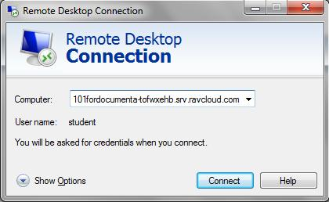{width="4.370138888888889in"
height="2.6847222222222222in"}

**-**Use Mozilla Browser on the Jumpbox and login to **LTM
(10.128.1.241)** & **GTM-EAST (10.128.1.246)**

-Login as = **admin/agility**

BIG-IP DNS: Global Server Load Balancing 
======================================================================================================================================================================================

Exercise 1.1 – Initial Setup
============================

-   **Objective:** To start off the labs, you will run through some
    basic configuration steps to get **GTM1 (10.128.1.246)** up
    and operational. Networking and NTP are already configured. You will
    be configuring the following:

    -   DNS Logging

    -   DNS Profile and Listeners

    -   Data Centers

    -   Server Objects

    -   Local LTM Virtual Server

-   Estimated completion time: 25 minutes

### TASK 1 – Configuring DNS Logging

-   You are going to configure DNS query and response logging. To do
    > this, you must tell GTM where to send logs to (a log publisher)
    > and what specifically to log (DNS logging profile).

-   For lab purposes, we are going to use local-syslog as our
    > logging destination. *Note that remote high speed logging is the
    > recommendation for production environments.*

-   In the GUI, navigate to: **System &gt; Logs &gt; Configuration &gt;
    > Log Publishers: Create**

-   Create a new DNS Log Publisher as shown in the table below. Keep the
    > defaults if not noted in the table.

  **Name**           dns-local-syslog
  ------------------ ----------------------------------------------
  **Destinations**   Move dns-local-syslog to the Selected column
                     Click Finished

-   In the GUI, navigate to: **DNS &gt; Delivery &gt; Profiles &gt;
    > Other &gt; DNS Logging: Create**

-   Create a new DNS logging profile as shown in the table below. Keep
    > the defaults if not noted in the table.

  **Name**               dns-logging
  ---------------------- -------------------------
  **Log Publisher**      Select dns-local-syslog
  **Log Responses**      Enabled
  **Include Query ID**   Enabled
                         Click Finished

-   Your new dns-logging profile should now have all options enabled.

### TASK 2 – Create a DNS Profile

-   A DNS profile tells the DNS Listener how to process DNS traffic.
    > We’re going to make some basic tweaks.

-   In the GUI, navigate to: **DNS &gt; Delivery &gt; Profiles &gt; DNS:
    > Create**

-   Create a new DNS profile as shown in the following table. Keep the
    > defaults if not noted in the table.

  **Name**                        my\_dns
  ------------------------------- ----------------
  **Unhandled Query Action**      Drop
  **Use BIND Server on Big-IP**   Disabled
  **Logging**                     Enabled
  **Logging Profile**             dns-logging
                                  Click Finished

### TASK 3 – Create a Listener

We are going to create UDP/TCP external Listeners. You will use this IP
as a target address when querying GTM.

In the GUI, navigate to: **DNS &gt; Delivery &gt; Listeners &gt;
Listener List: Create**

-   Create two external Listeners as shown in the tables below. Keep the
    > defaults if not noted in the table.

  **Name**                Listener-UDP
  ----------------------- ---------------------
  **Destination**         Host: 10.128.10.245
  **VLAN Traffic**        Enabled on..
  **VLANs and Tunnels**   External
  **DNS Profile**         my\_dns
                          Click Finished

  **Name**                Listener-TCP
  ----------------------- ---------------------
  **Destination**         Host: 10.128.10.245
  **VLAN Traffic**        Enabled on..
  **VLANs and Tunnels**   external
  **Protocol **           TCP
  **DNS Profile**         my\_dns
                          Click Finished

### TASK 4 – Create Data Centers

-   In the GUI, navigate to: **DNS &gt; GSLB &gt; Data Centers &gt; Data
    > Center List: Create**

-   Create two Data Centers as shown below. Leave all defaults unless
    > otherwise noted:

  **Name**       East
  -------------- ----------------
  **Location**   New York
                 Click Finished

  **Name**       West
  -------------- ----------------
  **Location**   Seattle
                 Click Finished

-   Your Data Center list should look like the diagram below. Why is the
    > status blue?

    {width="5.489361329833771in"
    height="1.0321872265966754in"}

### TASK 5 – Create GTM Server Object

By default, GTM is not self-aware. You will need to configure your BigIP
as a server object.

-   In the GUI, navigate to: **DNS &gt; GSLB &gt; Servers &gt; Server
    > List: Create**

-   Create a Server Object as defined in the table and diagram below.
    > Leave default values unless otherwise noted:

  **Name**                       gtm1-east
  ------------------------------ ---------------------
  **Product**                    Big-IP (Single)
  **Address List**               10.128.10.241 (Add)
  **Data Center**                East
  **Health Monitors**            Bigip
  **Virtual Server Discovery**   Disabled
                                 Click Create

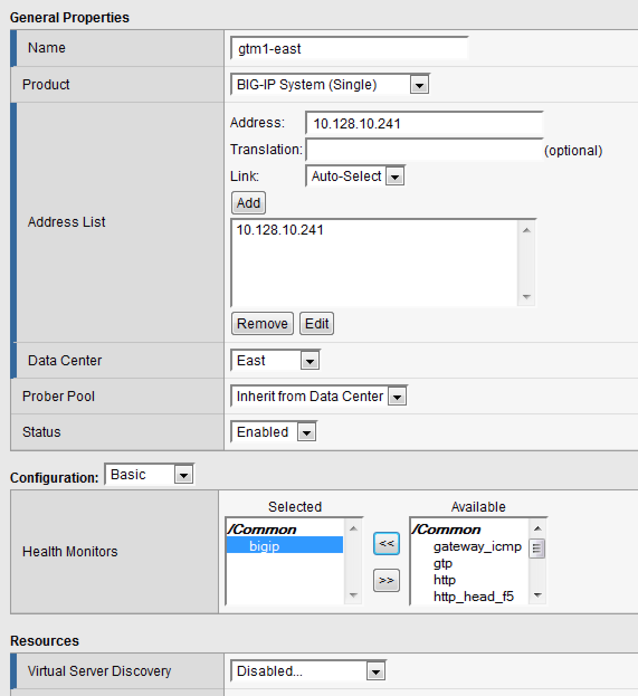{width="5.567239720034996in"
height="6.074499125109361in"}

-   Click on the “Server List” tab at the top menu bar to refresh
    the page. You should see the Server object as green.

    {width="5.475202318460193in"
    height="1.4863724846894137in"}\
    \
    What is the status of the East Data Center object now?

### TASK 6 – Create LTM Server Object

Students will be using an LTM object to serve as the East-LTM. You will
need to create another BigIP object to do this. Prior to configuring the
Server object, we need to establish trust between the GTM and LTM. The
bigip\_add script will exchange device certificates to establish a trust
relationship.

-   Login via SSH using putty to your GTM1 (10.128.1.245) using
    username: **root** password: **agility**

-   Issue the following commands.\
    \
    **bigip\_add 10.128.1.245**

    Type ‘**yes**’ to proceed and enter ‘**agility**’ as the password.

    Now type:\
    \
    **big3d\_install 10.128.1.245**

    Note that this script likely won’t need to install a new version of
    the big3d agent… this is just for you to be familiar with
    the script.

-   From the GTM1 GUI, navigate to: **DNS &gt; GSLB &gt; Servers&gt;
    > Server List: Create**

-   Create a Server Object as defined in the table and diagram below.
    > Leave default values unless otherwise noted:

  **Name**                       ltm-east
  ------------------------------ ---------------------
  **Product**                    Big-IP (Single)
  **Address List**               10.128.10.240 (Add)
  **Data Center**                East
  **Health Monitors**            Bigip
  **Virtual Server Discovery**   Enabled
                                 Click Create

-   After a few moments, click on the “Server List” tab at the top menu
    > bar to refresh the page. You should see the Server object
    > as green. You should also see virtual servers auto-discovered.
    > Below is a sample of what your screen should look like:

    {width="5.675785214348206in"
    height="1.7996806649168855in"}

-   Go to your SSH session on GTM1 and take a look at the /var/log/gtm
    > file to see what kinds of logs are generated after a server is
    > created.\
    > \
    > **tail -100 /var/log/gtm\
    > **

### TASK 7 – Create Generic Server Object

GTM can handle virtual servers that do not reside on a BigIP. The most
common way of incorporating non-F5 virtual server is using a Server type
of Generic Host.

-   In the GUI, navigate to: **DNS &gt; GSLB &gt; Servers &gt; Server
    > List: Create**

-   Create a Server Object as defined in the diagram below. Note that
    > the web virtual server is manually configured here and happens to
    > be the same IP address as the physical host.

    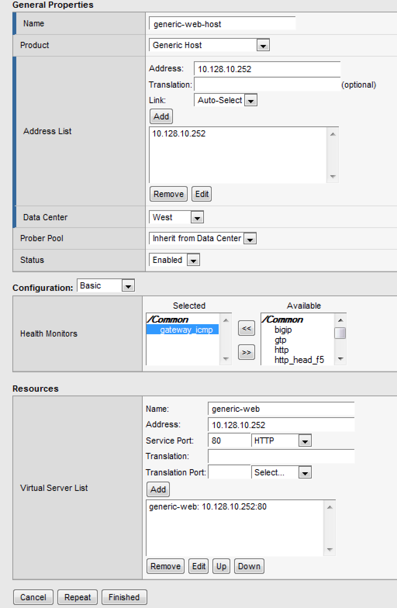{width="5.530203412073491in"
    height="8.467964785651793in"}

    After a few moments, click on the “Server List” tab at the top menu
    bar to refresh the page. You should eventually see the Server object
    as green.

    {width="5.592451881014873in"
    height="1.2433180227471565in"}

### TASK 8 – Create LTM Virtual Servers

Finally, we need to create another virtual server on our **LTM–East**
(10.128.1.245)

-   Login to https://10.128.1.245 with admin\\agility if you haven’t
    > already

-   In the GUI, navigate to: **Local Traffic &gt; Pools &gt; Pool List:
    > Create**

-   Create a LTM Pool as defined in the table below. Leave default
    > values unless otherwise noted:

  ---------------------------------------------
  **Name**              pool\_webapp1\_east
  --------------------- -----------------------
  **Health Monitors**   http

  **New Members**       Address: 10.128.20.11
                        
                        Service Port: 80\
                        \
                        Address: 10.128.20.12
                        
                        Service Port: 80

                        Click Finished
  ---------------------------------------------

-   In the GUI, navigate to: **Local Traffic &gt; Virtual Servers &gt;
    > Virtual Server List: Create**

-   Create a Virtual Server as defined in the table and diagram below.
    > Leave default values unless otherwise noted:

  **Name**                         virtual\_webapp1\_east
  -------------------------------- ------------------------
  **Destination (Host)**           10.128.10.10
  **Service Port**                 80
  **Source Address Translation**   Auto Map
  **Default Pool**                 pool\_webapp1\_east

\*\***Test new east coast virtual server in browser by hitting :
<http://10.128.10.110>**

-   Return to GTM1 GUI and navigate to: **DNS &gt; GSLB &gt;
    > Servers &gt; Server List.** You should now see that the
    > **gtm1-east** has auto-discovered 1 new Virtual Server for the
    > **ltm-east** server for a total of 2 Virtual Servers.

    {width="6.25911854768154in"
    height="2.1763877952755903in"}

-   In the GUI, navigate to: **Statistics &gt; Module Statistics &gt;
    > DNS &gt; GSLB.** Select “iQuery” from the **Statistics
    > Type** menu.

    STOP – You have completed lab 1

Exercise 2.1 – GSLB Active/Standby Data Centers
============================================================================================================================================================================================

-   In this use-case, you will configure a WideIP for a disaster
    recovery scenario. In this case, East will always be preferred while
    West is only used if East is down.

-   Estimated completion time: 10 minutes

### TASK 1 – Create a GTM Pool

-   From the GTM1 GUI, navigate to: **DNS &gt; GSLB &gt; Pools &gt; Pool
    > List: Create.** Create a new Pool as shown in the table and
    > diagram below. Keep the defaults if not noted in the table.

  -------------------------------------------------------------------
  **Name**                    pool\_DR
  --------------------------- ---------------------------------------
  **Type**                    A

  **Load Balancing Method**   Preferred: Global Availability

  **Virtual Servers**         Virtual\_webapp1\_east – 10.128.10.10
                              
                              Generic\_host\_west – 10.128.10.252
  -------------------------------------------------------------------

Make sure that the east VS is at the top of the Member List as shown
below. This is an ordered failover from top to bottom.

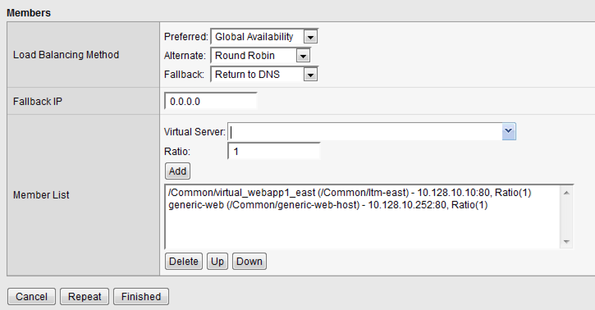{width="5.503979658792651in"
height="2.8696380139982502in"}

### TASK 2 – Create a WideIP

We will create a hostname to use as a Wide IP.

-   In the GUI, navigate to: **DNS &gt; GSLB &gt; Wide IPs &gt; Wide IP
    > List: Create.** Create a new Wide IP as shown in the table below.
    > Keep the defaults if not noted in the table.

  **Name**                dr.webapp1.com
  ----------------------- ----------------
  **Type**                A
  **Pools – Pool List**   pool\_DR (Add)

-   Open a Command Prompt window on your Windows jump box and query your
    > Listener for the Wide IP. You may wish to issue this command
    > several times:

    **nslookup.dr.webapp1.com 10.128.10.245**

    Your results should look like the following example:

    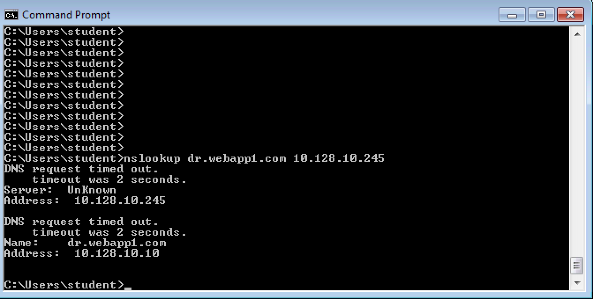{width="5.75911854768154in"
    height="2.913596894138233in"}

    Try hitting [**http://dr.webapp1.com**](http://www.webapp1.com) in
    a browser. You should get the East Coast Data Center every time.

    Now is a good time to view query logging. In the SSH shell on the
    **GTM**, view the logs in /var/log/ltm:\
    **tail –f /var/log/ltm\
    **

<!-- -->

-   Now we are going to intentionally fail the east VS. To do this,
    we’re going to assign a bad monitor to the LTM VS to simulate the
    application failing. Before we do this, open an SSH session to your
    GTM1 and tail the log file:\
    \
    **tail –f /var/log/gtm**

<!-- -->

-   While the log is updating, navigate in the LTM-East to **Local
    Traffic &gt; Pools &gt; Pool List.** Select the
    pool\_webapp1\_east pool. Change the selected Health Monitor to udp
    as shown below:

    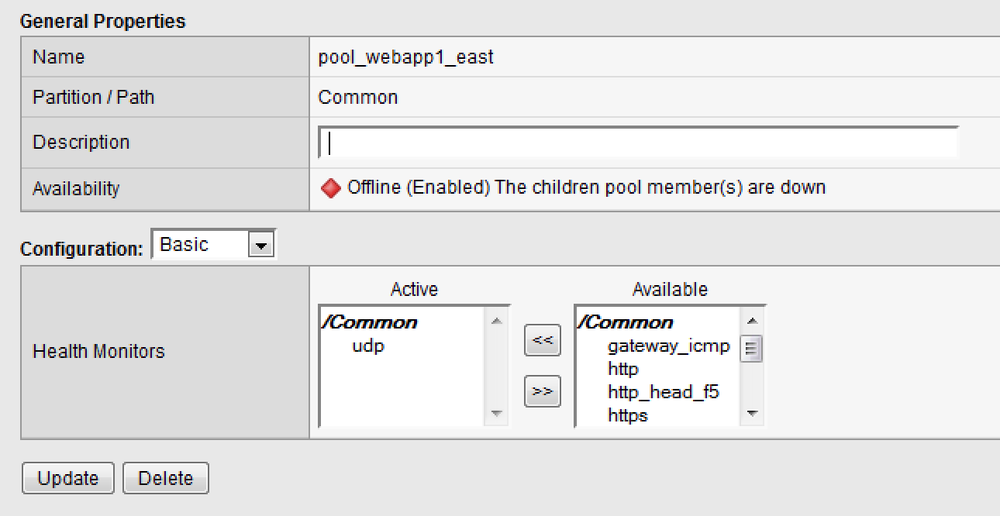{width="5.600648512685915in"
    height="2.8913517060367453in"}\
    \
    The LTM pool will turn red in about 30 seconds and you will see log
    messages in /var/log/gtm show up showing that GTM has learned the
    health via iQuery.

    Query the WideIP again from the Command Prompt and note the results.
    The west server IP should be returned.\
    **nslookup.dr.webapp1.com 10.128.10.245**

    10.128.10.252 &lt;- Generic Host in the West Data Center

    You can also try refreshing the web page from a browser – you should
    be directed to the Node \#3 (green headline)

-   Now go back and remove the https monitor on virtual-server-east-pool
    and put back the http monitor. Note the log messages
    in /var/log/gtm.

-   Query the WideIP again and note your results. Did it fail back?

###  TASK 3 – Configure Fallback 

We will create a scenario for a fallback option when both east and west
Virtual Servers are unavailable.

-   In the GTM1 GUI, navigate to : **DNS &gt; GSLB &gt; Pools &gt;
    Pool List.** Select the pool **pool\_DR**. Select the **Members**
    tab in the middle menu bar. Make the following changes as noted in
    the table.

  --------------------------------------------------------------
  **Load Balancing Method **   Preferred: Global Availability\
                               Alternate: None
                               
                               Fallback: Fallback IP
  ---------------------------- ---------------------------------
  **Fallback IPv4 **           1.1.1.1
  --------------------------------------------------------------

-   Click **Update**

-   Now highlight both members in the checkboxes to the left and click
    **Disable**. Your GUI should look similar to the following diagram:

    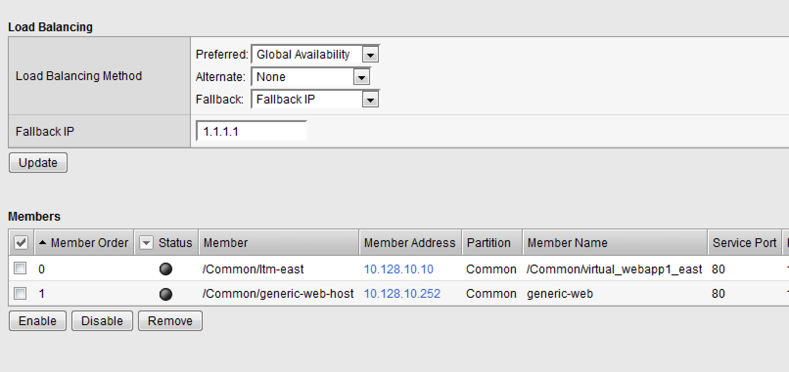{width="5.570251531058617in"
    height="2.6331397637795275in"}

-   In the Command Prompt window, query the WideIP again and note
    the results. They should look similar to below and show fallback:\
    **nslookup.dr.webapp1.com 10.128.10.245**

    1.  Fallback IP address which can be a sorry server for maintenance

-   Return to the GTM1 GUI go to **Statistics &gt; Module
    Statistics &gt; DNS &gt; GSLB.** Under ‘Statistics Type’, select
    **Pools.** You should see statistics for Preferred, Alternate, and
    Fallback algorithms. You should see Fallback statistics updated:

    {width="5.678518153980752in"
    height="1.92584208223972in"}

-   Go back and re-enable your pool members.

Exercise 2.2 – GSLB Active/Active Data Centers
============================================================================================================================================

-   In this use-case, you will configure a WideIP that sends clients to
    both East and West Data Centers. This will involve scenarios with
    and without persistence.

-   Estimated completion time: 15 minutes

### TASK 1 – Create a GTM Pool

-   In the GUI on your GTM, navigate to: **DNS &gt; GSLB &gt; Pools &gt;
    > Pool List: Create.** Create a new Pool as shown in the table and
    > diagram below. Keep the defaults if not noted in the table.

  -------------------------------------------------------------------
  **Name**                    pool\_RR
  --------------------------- ---------------------------------------
  **Type**                    A

  **Load Balancing Method**   Preferred: Round Robin (default)

  **Add Virtual Servers**     Virtual\_webapp1\_east – 10.128.10.10
                              
                              generic\_web – 10.128.10.252

                              Click Finished
  -------------------------------------------------------------------

### TASK 2 – Create a WideIP

We will create a hostname to use as a Wide IP.

-   In the GUI, navigate to: **DNS &gt; GSLB &gt; Wide IPs &gt; Wide IP
    > List: Create.** Create a new Wide IP as shown in the table below.
    > Keep the defaults if not noted in the table.

  **Name**                rr.webapp1.com
  ----------------------- ----------------
  **Type**                A
  **Pools – Pool List**   pool\_RR (Add)
                          Click Finished

-   From Command Prompt on your Windows machine, query your Listener for
    > the Wide IP. You may wish to issue this command several times:

    **nslookup.rr.webapp1.com 10.128.10.245**

    You should see the east and west coast IPs returned in a round robin
    fashion - sometimes 2 in a row for each due to the multiple
    instances of TMM running on the virtual appliance.

    You can also see the results in a browser by going to
    [**http://rr.webapp1.com**](http://rr.webapp1.com)

    Refresh the page several times and you should see the round robin
    behavior in the browser.

-   Your results should have round robin of answers going between east
    and west Virtual Servers.

-   From GTM1 GUI to **Statistics &gt; Module Statistics &gt;
    DNS &gt; GSLB.** Under ‘Statistics Type’, select **Pools.** Click on
    **View** under the ‘Members’ column for **pool\_RR**. You should see
    an even distribution between members similar to the diagram below:\
    \
    {width="5.709938757655293in"
    height="0.6288134295713036in"}

### TASK 3 – Adding WideIP Alias

GTM allows for a single WideIP configuration to be used for multiple
names, including wildcards. We are going to add a domain name and an
example wildcard.

-   In the GUI, navigate to: **DNS &gt; GSLB &gt; Wide IPs &gt; Wide
    IP List.** Select ***rr.webapp1.com*** and change **General
    Properties** to **Advanced**. Under the Alias List, add the
    following entries as shown in the diagram below.

-   webapp1.com

-   r\*.webapp1.com

-   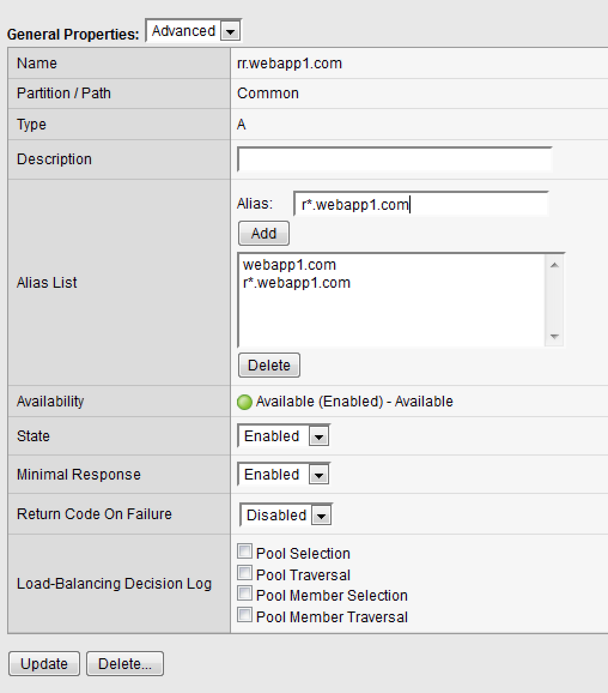{width="5.859476159230097in"
    height="6.666943350831146in"}

-   Issue each of the following DNS queries multiple times from a
    Command Prompt:

-   nslookup.webapp1.com 10.128.10.245

-   nslookup.rooster.webapp1.com 10.128.10.245

    Do you see a round robin behavior with above names as expected?

### TASK 4 – Adding Persistence

Many applications require session persistence. As a result, GTM needs to
send clients to the same Data Center via GSLB-level persistence.

-   From the GTM1 GUI, navigate to: **DNS &gt; GSLB &gt; Wide IPs &gt;
    Wide IP List.** Select ***rr.webapp1.com***. Select **Pools** from
    the middle menu bar. Make the following changes

-   Enable Persistence

-   Change the Persistence TTL to 30 seconds

-   Click **Update\
    \
    **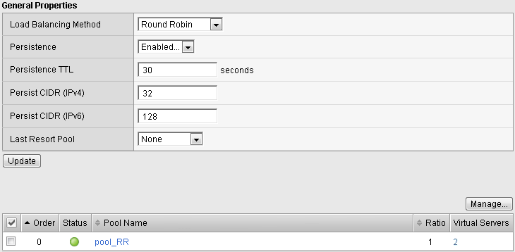{width="4.886075021872266in"
    height="2.3960564304461944in"}

-   From Command Prompt, query the WideIP ***rr.webapp1.com*** several
    times and note the results. Do you see the same response each time?

-   In the GUI, navigate to: **Statistics &gt; Module Statistics &gt;
    DNS &gt; GSLB.** Under ‘Statistics Type’, select
    **Persistence Records.** Note that because the Persistence TTL is
    only 30 seconds, you may need to send another query to generate
    a record. After 30 seconds expires, you should note the
    record disappearing.

-   **\*\*NOTE:** As of v12, persistence record statistics and logging
    is disabled. If you get the error message in the GUI, follow the
    directions and run the following from the CLI on GTM1. This will
    change the DB variable to allow you to view the persistence records
    in the GUI:

    **tmsh**

    **modify sys db
    ui.statistics.modulestatistics.dnsgslb.persistencerecords value
    true**

-   Query the Wide IP again and then refresh the persistence record
    screen in the GUI\
    \
    {width="5.795451662292214in"
    height="1.3381146106736659in"}

Exercise 2.3 – GSLB with Topology
===============================================================================================================================

-   In this use-case, you will send clients to a preferred geographic
    location using Topology. We are also going to incorporate the use of
    multiple pools in this lab to introduce WideIP-level load balancing.

-   Estimated completion time: 10 minutes

### TASK 1 – Create GTM Pools

-   From the GTM1 GUI, navigate to: **DNS &gt; GSLB &gt; Pools &gt; Pool
    > List: Create.** Create new Pools as shown in the table and
    > diagram below. Keep the defaults if not noted in the table.

  --------------------------------------------------------------------------------------------------------------------
  **Name**                    pool-east
  --------------------------- ----------------------------------------------------------------------------------------
  **Type**                    A

  **Load Balancing Method**   Preferred: Global Availability

  **Add Virtual Servers**     Virtual\_webapp1\_east - 10.128.10.10:80
                              
                              generic\_web – 10.128.10.252:80 (add this in case the east server becomes unavailable)

                              Click Finished
  --------------------------------------------------------------------------------------------------------------------

  **Name**                    pool-west
  --------------------------- ------------------------
  **Type**                    A
  **Load Balancing Method**   Preferred: Round Robin
  **Virtual Servers**         generic\_web
                              Click Finished

### TASK 2 – Create Topology Records

We will create topology records to define source IPs that will prefer
east or west Data Centers. We are going to have your workstation prefer
east, while LTM-east host will prefer west.

-   In the GUI, navigate to: **DNS &gt; GSLB &gt; Topology &gt;
    > Records: Create.** Create two new records as shown in the tables
    > below:

    **Topology Record 1**

  **Request Source**                    IP Subnet is 10.128.10.247/32
  ------------------------------------- -------------------------------
  **Destination - Pools – Pool List**   pool\_west
  **Weight**                            100

**Topology Record 2**

  **Request Source**                    IP Subnet is 10.0.0.0/24
  ------------------------------------- --------------------------
  **Destination - Pools – Pool List**   pool\_east
  **Weight**                            100

{width="5.745457130358705in"
height="1.2122506561679791in"}

### TASK 3 – Create a WideIP

We will create a hostname to use as a Wide IP for Toplogy LB.

-   From the GTM1 GUI, navigate to: **DNS &gt; GSLB &gt; Wide IPs &gt;
    > Wide IP List: Create.** Create a new Wide IP as shown in the
    > table below. Keep the defaults if not noted in the table.

  --------------------------------------------------
  **Name**                    topology.webapp1.com
  --------------------------- ----------------------
  **Type**                    A

  **Load Balancing Method**   Topology

  **Pool List**               pool\_east (add)\
                              pool\_west (add)
  --------------------------------------------------

-   Issue the following DNS query multiple times from a command prompt
    on your Windows workstation:

-   nslookup topology.webapp1.com 10.128.10.245

    You should see the IP address for the East Data Center –
    10.128.10.10 because you are coming from 10.128.10.5 which falls
    under Topology Record \#1 that you created above.

-   Open an SSH session to the LTM-east if you don’t have one
    open already.

-   IP: 10.128.1.245

-   User/pass: root/agility

-   Issue the following DNS query multiple times:

    -   tmsh dig @10.128.10.245 topology.webapp1.com

        You should see the IP address for the generic web server in the
        west data center returned (10.128.10.252).

        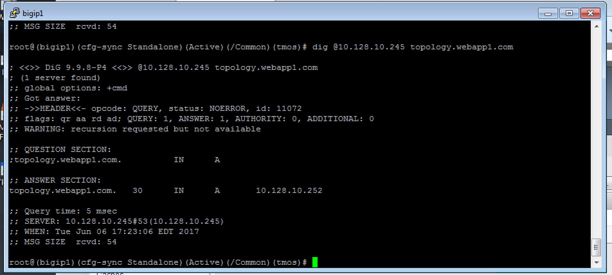{width="5.590410104986876in"
        height="2.5193186789151354in"}

        

Exercise 3.1 – Creating a Synchronization Group
===============================================

-   In this use-case, you will create a sync group to be used between
    GTM1 and GTM2

    -   GTM1 will be used as the “existing GTM”.

    -   GTM2 will be used as the “new GTM”. This unit will end up
        consuming and having a copy of the config from the
        “existing GTM”.

-   Estimated completion time: 15 minutes

### TASK 1 – Create Server Object on GTM1

-   Log in to **GTM2 (10.128.1.247)** using admin\\agility and notice
    > there is no DNS WideIPs, servers, or data centers configured

-   From GTM1 we will need to add GTM2 as a Server object.

-   From **GTM1** GUI, navigate to: **DNS &gt; GSLB &gt; Servers &gt;
    > Server List: Create**

  **Name**                       gtm2-west
  ------------------------------ ---------------------
  **Product**                    Big-IP (Single)
  **Address List**               10.128.10.247 (Add)
  **Data Center**                West
  **Health Monitors**            Bigip
  **Virtual Server Discovery**   Disabled
                                 Click Create

-   ### Notice the gtm2-west server object stays blue on the server list screen. This is because we haven’t created the trust between the devices yet.

-   ### From GTM1 SSH session, issue the following command.

> **bigip\_add 10.128.10.242**
>
> Type ‘yes’ to proceed and enter ‘default’ as the password.
>
> \*\*Notice gtm2-west should have turned green in the server list

### TASK 2 – Create a Synchronization Group

-   ***On GTM1*** in the GUI, navigate to: **DNS &gt; Settings &gt;
    > GSLB &gt; General. **

-   Enable the **Synchronize** checkbox.

-   Change the Group Name as **Agility**

-   Enable the **Synchronize DNS Zone Files** checkbox.

    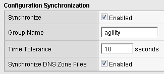{width="2.518727034120735in"
    height="1.1392399387576553in"}

### TASK 3 – Add New GTM to Synchronization Group

We will run the **gtm\_add** script to add the “new GTM” to the
synchronization group with the “existing GTM”. Note, **always run this
script on the NEW GTM device**. Running this script on the configured
GTM device will sync to the new device and erase the current
configuration! So be very careful!

-   Use PUTTY to log in to the new **gtm2 (10.128.1.247)** with
    root\\agility and run the following command:

    **gtm\_add 10.128.10.241**

    Type ‘**y**’ to proceed. If prompted for a password use ‘agility’.

-   To validate the sync group is setup properly, navigate through the
    GUI to see if the configurations are the same. You may want to look
    at the Server definitions, Wide IPs, etc.

-   If the configs look equal, make a change on one GTM and see if it
    shows up on the other. Repeat in the reverse direction. \*\***Note -
    There is NO MASTER! Any change on any GTM in a sync group is
    automatically replicated to all other GTMs in the group**.

-   From your workstation, query each Listener (gtm1 – 10.128.10.245 and
    gtm2 – 10.128.10.246) for a given Wide IP and verify that the
    responses are as expected.
